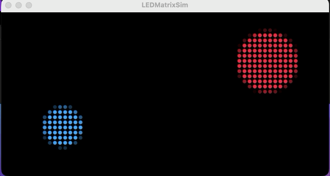

# LED Matrix Simulator (Processing)

A Processing template for designing visuals for a **64x32 RGB LED matrix**
(e.g. the [Adafruit 2278](https://www.adafruit.com/product/2278), 4mm pitch)
without needing the physical hardware. Draw at a comfortable 640x320
resolution using normal Processing calls, and the sketch downsamples and
renders it back as a grid of round LEDs so you can see roughly how it'll
look on the real panel.



## Why this exists

Designing pixel art / animations directly at 64x32 is fiddly — shapes,
text, and curves all need to be figured out at a resolution too small to
work in comfortably. This template lets you draw at 640x320 (10x scale)
using the full Processing API (shapes, PImage, PFont, video, whatever you
like), and handles the downsampling and LED-style rendering for you.

## Requirements

- [Processing](https://processing.org/download) 4.x, Java mode (the default).
  No extra libraries required — everything here uses core Processing.

## Getting started

1. Clone or download this repo.
2. Open `LEDMatrixSim/LEDMatrixSim.pde` in the Processing IDE.
3. Press **Run**. You should see two overlapping circles orbiting the
   center, rendered as a grid of dots.
4. Press **`d`** to toggle between the simulated LED view and the raw
   640x320 canvas — handy for checking what you're actually drawing before
   it gets downsampled.

## How it works

```
drawVisual(canvas, t)     draw your visual at 640x320 into an offscreen PGraphics
        │
        ▼
   downsample()           average every 10x10 block down to one color (64x32 total)
        │
        ▼
   renderMatrix()          draw each of the 64x32 colors as a round "LED" with
                            a dark gap around it, mimicking the real panel
```

The only function you need to edit is `drawVisual()`. Everything else
(downsampling, LED rendering, the debug toggle) is infrastructure you
shouldn't need to touch.

```java
void drawVisual(PGraphics pg, float t) {
  pg.background(0);
  pg.noStroke();
  pg.fill(255);
  pg.ellipse(pg.width / 2, pg.height / 2, 80, 80);
}
```

- `pg` — the 640x320 offscreen canvas. Use the same drawing calls you'd use
  in a normal sketch, just prefixed with `pg.` (`pg.fill()`, `pg.rect()`,
  `pg.text()`, `pg.image()`, etc.)
- `t` — seconds elapsed since the sketch started (`frameCount / 60.0`),
  useful for animation.

**Always set fill/stroke explicitly** (`pg.fill(...)`, `pg.noStroke()`)
rather than relying on defaults — style state on an offscreen `PGraphics`
persists frame to frame, so an explicit call is the only reliable way to
know what you'll get.

## Matrix specs

| Setting        | Value |
|----------------|-------|
| Matrix size    | 64 x 32 LEDs |
| Canvas size    | 640 x 320 px |
| Scale factor   | 10 px per LED |

These live as constants (`MATRIX_W`, `MATRIX_H`, `SCALE`) at the top of
`LEDMatrixSim.pde` if you're adapting this for a differently-sized panel —
just change them and everything downstream (canvas size, downsampling,
rendering) adjusts automatically.

## Tutorials

### 1. Static shapes

Draw anything you'd draw in a normal Processing sketch — it just needs the
`pg.` prefix:

```java
void drawVisual(PGraphics pg, float t) {
  pg.background(0);
  pg.noStroke();

  pg.fill(255, 0, 0);
  pg.rect(40, 40, 200, 200);

  pg.fill(0, 255, 0);
  pg.triangle(400, 60, 320, 260, 480, 260);
}
```

### 2. Simple animation

Use `t` to drive motion. Since `t` is in seconds, `sin(t)`/`cos(t)`
complete one cycle roughly every 6.3 seconds — multiply `t` to speed it up.

```java
void drawVisual(PGraphics pg, float t) {
  pg.background(0);
  pg.noStroke();
  pg.fill(255, 200, 0);

  float x = pg.width / 2 + cos(t * 2) * 250;
  float y = pg.height / 2 + sin(t * 2) * 120;
  pg.ellipse(x, y, 60, 60);
}
```

### 3. Text / scrolling marquee

Text is legible on a 64x32 matrix only in short bursts or scrolled — this
scrolls a message right to left.

```java
PFont font;

void setup() {
  size(640, 320);
  pixelDensity(1);
  canvas = createGraphics(CANVAS_W, CANVAS_H);
  noStroke();
  font = createFont("Arial Bold", 200);
}

void drawVisual(PGraphics pg, float t) {
  pg.background(0);
  pg.fill(255);
  pg.textFont(font);
  pg.textAlign(LEFT, CENTER);

  float speed = 150; // px/sec
  float x = pg.width - (t * speed) % (pg.width + 800);
  pg.text("HELLO WORLD", x, pg.height / 2);
}
```

### 4. Using pixel/image data

Load a small image and draw it directly — since the canvas is 10x the
matrix resolution, a 64x32 source image can be drawn at 640x320 with
`pg.noSmooth()` for a crisp blocky look, or a larger image can be scaled
down for a smoother, anti-aliased result once downsampled.

```java
PImage img;

void setup() {
  size(640, 320);
  pixelDensity(1);
  canvas = createGraphics(CANVAS_W, CANVAS_H);
  noStroke();
  img = loadImage("sprite.png"); // put sprite.png in the sketch's data/ folder
}

void drawVisual(PGraphics pg, float t) {
  pg.background(0);
  pg.image(img, 0, 0, pg.width, pg.height);
}
```

### 5. Reacting to audio/sensors (bring your own library)

Because `drawVisual()` just draws into a normal `PGraphics`, you can feed it
from anything Processing can read — the Sound library, Serial input from a
sensor, OSC, etc. Do your library setup in the sketch's `setup()` as usual,
then read values inside `drawVisual()`:

```java
import processing.sound.*;
AudioIn mic;
Amplitude amp;

void setup() {
  size(640, 320);
  pixelDensity(1);
  canvas = createGraphics(CANVAS_W, CANVAS_H);
  noStroke();
  mic = new AudioIn(this, 0);
  mic.start();
  amp = new Amplitude(this);
  amp.input(mic);
}

void drawVisual(PGraphics pg, float t) {
  pg.background(0);
  float level = amp.analyze();
  float barHeight = level * pg.height * 8;
  pg.fill(0, 255, 255);
  pg.rect(0, pg.height - barHeight, pg.width, barHeight);
}
```

## Adapting for a different panel size

Editing the constants at the top of `LEDMatrixSim.pde` retargets the whole
template to a different matrix (e.g. a 32x32 panel):

```java
final int MATRIX_W = 32;
final int MATRIX_H = 32;
final int SCALE     = 10;
```

Canvas size, downsampling, and rendering all derive from these — no other
changes needed.

## Troubleshooting

**Sketch runs but the window is solid black.**
Make sure you're setting fill/stroke explicitly in `drawVisual()`
(`pg.fill(...)`, `pg.noStroke()`) rather than relying on defaults.

**Shapes appear torn or wrapped from one edge to the other.**
This is a Retina/HiDPI pixel-density mismatch — Processing's `pixels[]`
buffer can be `width*2` px wide on high-DPI displays even though `width`
still reports the logical size, which breaks the downsampling math. Make
sure `pixelDensity(1);` is called in `setup()` right after `size()` (it's
included by default in this template).

## License

GPLv3 — see [LICENSE](LICENSE). You're free to use, modify, and share this,
but derivative works must also be open-sourced under GPLv3.
